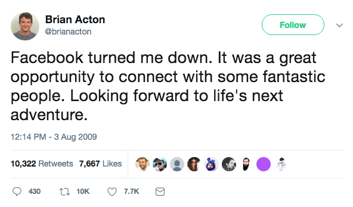
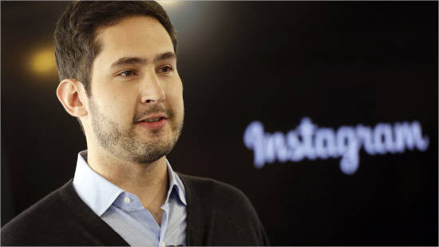
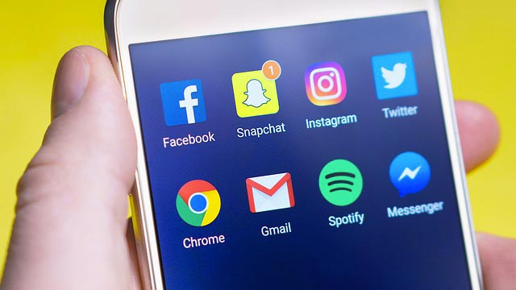

تتميز مهنة المبرمج عن غيرها من المهن بكونها كفيلة بجعل صاحبها غنيا وناجحا ماليا في مدة زمنية قصيرة وبأقل مجهود. وقد فرضت ظاهرة المبرمجين الأثرياء نفسها بقوة بعد انفجار ثورة الهواتف الذكية وانتشار استخدام الإنترنت بين البشر، ليشمل أزيد من 4 مليارات نسمة في أحدث التقديرات، أي ما يمثل زهاء %55 من سكان الكرة الأرضية.

هذا يعني بأن المبرمج يملك قاعدة مفترضة من المستخدمين تعد بالمليارات، يستطيع الوصول إليها فقط بمهاراته في البرمجة وشيء من أساليب التسويق الإلكتروني الحديثة.

وإذا ما نظرنا إلى [لائحة أغنى الشباب في العالم](https://www.independent.co.uk/news/people/the-20-youngest-self-made-billionaires-in-the-world-a6909566.html) سنجد بأن أغلبهم كونوا ثرواتهم الضخمة من مشاريع برمجية بدؤوها من الصفر ليحققوا بفضلها الآن مليارات الدولارات، تتضاعف كل عام مع ازدياد نسب المستخدمين التي يصلون إليها من الأربع مليارات المذكورة أعلاه.

في هذا المقال، سأذكر ـ باختصار ـ قصص مجموعة من أنجح المبرمجين على مستوى العالم، وهدفي الأول إعطاؤكم جرعة من التحفيز والإلهام ولكي نعرف جميعا بأن فرص تحقيق الثراء المالي أصبحت في متناول الجميع اليوم أكثر من أي وقت مضى.

## 1. بيل غيتس

كان **بيل غيتس** وصديقه **بول آلن** من المهووسين بمجال الحاسوب. وقد جعلتهما هذه الإهتمامات المشتركة يطمحان إلى إنتاج حاسوب خاص بهما.

في يناير من عام 1975، قامت شركة MITS بإنتاج حاسب [Altair 8800](https://en.wikipedia.org/wiki/Altair_8800) ولقد كان هذا الحدث المميز آنذاك مصدر إلهام لبيل وبول، فقاما بإنشاء مفسر ( _Interpreter_ ) للغة البرمجة BASIC واقترحاه على شركة MITS ليتم استخدامه في أجهزة Altair 8800. بعد معاينة المفسر واختباره، اقتنع المسؤولون عن الشركة بأنه جدير بأن يتم دمجه وتشغيله في جهازهم، فعقدوا صفقة مع غيتس وآلن يزودان بموجبها شركة _Altair 8800_ بهذه المفسرات التي تقرر تسميتها _Altair BASIC_.

كانت هذه الصفقة وراء إنشاء بيل غيتس وبول آلن لشركتهما الخاصة في أبريل 1975 وسموها "Micro-Soft"، ليصبح اسمها بعد ذلك **Microsoft** وتقوم بإنتاج نظام التشغيل _Windows_ الأكثر استخداما في العالم، والعديد من المنتجات الرقمية الأخرى.

هذه النجاحات جعلت بيل غيتس يراكم ثروات ضخمة فاقت 80 مليار دولار، جعلته يتربع على عرش الأغنى في العالم لسنوات طويلة.

## 2. مارك زوكربيرغ

عرف **مارك زوكربيرغ** بولعه الشديد بالبرمجة والحاسوب منذ طفولته، ولقد عمل والده على صقل مهاراته في هذا المجال، فقام بتعليمه البرمجة باستخدام _Atari Basic_ وعين مهندس برمجيات اسمه **دافيد نيومان** كمعلم خاص لابنه.

استهل مارك ابداعاته في مرحلة الثانوية العامة، حيث قام بتطوير مشغل موسيقى تحت مسمى _Synapse Media Player_، واعتمد فيه على تقنيات تعلم الآلة لمعرفة عادات المستخدم في الاستماع. حاولت مايكروسوفت وAOL أن تشتري هذا المشغل وتوظف زوكربيرج لديها ولكنه رفض وفضل تحميله بالمجان والالتحاق بجامعة هارفارد.

في فترة دراسته بجامعة هارفرد العريقة، قام مارك بإنشاء موقع إلكتروني كمنصة للتواصل بين طلاب الجامعات والثانويات وسماه _thefacebook.com_، على أن يصبح بعد ذلك _facebook.com_.

عدد مستخدمي هذا الموقع، الذي انطلق من داخل أسوار الجامعة، وصل لأزيد من 5 ملايين، ليقرر زوكربيرغ بعدها إتاحته لعامة الناس وجعله أكبر موقع تواصل اجتماعي يصل عدد مستخدميه اليوم لأزيد من 2 مليار مستخدم!

اليوم مارك زوكيربرغ هو أغنى شخص دون سن الأربعين في العالم، بثروة فاقت 70 مليار دولار في أحدث التقديرات.

## 3. براين أكتون

عمل براين أكتون موظفا لدى شركة ياهو لسنوات طويلة. وفي عام 2009 قرر البحث عن تحدٍّ جديد في شركة فيسبوك، فتقدم لمقابلة عمل معهم ولكنها مع الأسف لم تفضي إلى ما كان يطمح إليه، ليذهب حلمه بالعمل مع هذه الشركة أدراج الرياح.

وعبر براين عن خيبة أمله من عدم نجاحه في عدم إقناع مسؤولي شركة فيسبوك بإمكاناته، حيث قال عبر تغريدة على تويتر :

**فيسبوك قامت برفضي. لقد كانت فرصة عظيمة للتواصل مع أشخاص رائعين. أتطلع إلى المغامرة الكبيرة القادمة في هذه الحياة.**

لقد كان براين يعي ما يقول تماما، فمباشرة بعد هذه التجربة المريرة مع فيسبوك، قرر الرجل بدء مغامرته الكبيرة مع صديق له يدعى*Jan Koum*، حيث قررا البدء في بناء تطبيق محمول للتواصل الآني بين المستخدمين. هذه التطبيق لم يكن سوى **WhatsApp** الذي سرعان ما لاقى نجاحا كبيرا بعدما وصل عدد مستخدميه لقرابة 400 مليون مستخدم.

شركة فيسبوك كانت تتابع قصة نجاح واتساب عن كثب، ليقرر مسؤولوها في عام 2014 تقديم عرض ضخم لبراين وشركاؤه وصلت قيمته لما يقارب 19 مليار دولار للإستحواذ على التطبيق. تمت الصفقة بنجاح ليجبر براين الشركة التي رفضته قبل 5 سنوات على دفع هذا المبلغ الهائل مقابل ثمرة اجتهاده التي، على الأرجح، لم يكن ليحصدها لو تم قبوله في تلك المقابلة.

## 4. كيفن سيستروم

كان كيفن سيستروم، خريج جامعة ستانفورد، مهتما بشكل كبير بالتصوير والفوتوغرافيا، رغم أن هذا لم مجال عمله ولا تخصصه.

هذه الهواية ربما كانت السبب الذي دفعه للبدء في عمله على إنشاء تطبيق HTML 5 مشابه ل Foursquare مع ميزة مشاركة الصور. _Burbn_ كان اسم هذا التطبيق الذي لم يلقى النجاح المأمول رغم أن كيفن حصل بفضله على جولة تمويلية بقيمة نصف مليون دولار من مستثمرين.

حاول كيفن تحليل وفهم الأسباب التي حالت دون تحقيق **Burbn** النجاح الذي كان متوقعا منه، فافترض بأن عدد الميزات الكبير في التطبيق ربما شكل مصدر إرباك وإزعاج للمستخدمين، ما منعه من تحقيق الإنتشار والقبول.

بعد الإستفادة من تلك التجربة، قرر Kevin التعاون مع زميل له اسمه *Mike Krieger* لإنشاء تطبيق آخر يكون هذه المرة خاصا بمشاركة الصور فقط، ولم يحتاجوا من الوقت سوى 8 أسابيع لإطلاق نسخته الأولى تحت مسمى **Instagram**.

بعد أقل من شهرين، وصل عدد مستخدمي التطبيق لمليون مستخدم، وتضاعف 10 مرات خلال عام واحد. وبعد أقل من عامين، بعدما أصبح _Instagram_ أشهر تطبيق لمشاركة الصور في العالم، قامت شركة فيسبوك بشراءه في صفقة بلغت قيمتها 1 مليار دولار، حصل منها كيفن على قرابة 400 مليون دولار وهو لم يكمل بعد آنذاك عقده الثالث.

## 5. إيفان سبيغل

ذات يوم، قال **ريجي براون**، صديق _إيفان_ من جامعة ستانفورد، أنه [يتمنى أن تختفي الصور التي يقوم بإرسالها إلى صديقته](https://www.tech-wd.com/wd/2015/10/18/%D8%B3%D9%86%D8%A7%D8%A8-%D8%B4%D8%A7%D8%AA%D8%8C-%D9%82%D8%B5%D8%A9-%D8%A3%D8%B5%D8%BA%D8%B1-%D9%85%D9%84%D9%8A%D8%A7%D8%B1%D8%AF%D9%8A%D8%B1-%D9%81%D9%8A-%D8%A7%D9%84%D8%B9%D8%A7%D9%84%D9%85/)!

هذه الجملة لم تمر مرور الكرام على مسمع **Evan Spiegel** الذي تنبه إلى قابلية هذه الجملة لتكون فكرة قوية يبني عليها تطبيقه الذي يقوم بحذف صور وفيديوهات المستخدمين بشكل آلي بعد مدة زمنية محددة. وفعلا لم ينتظر إيفان وصديقه طويلا للبدء في بناء هذا التطبيق وتحويل الفكرة لأرض الواقع. وبسبب محدودية مهاراتهما التقنية قررا الإستعانة بصديق ثالث اسمه **بوبي مورفي** ليقوم ببرمجة التطبيق.

في البداية حمل هذا التطبيق اسم _Pictaboo_، ولكنه لم يحقق آنذاك النجاح المتوقع، إذ لم يتجاوز عدد المستخدمين بضع مئات فقط. وازدادت الأمور تعقيدا بعدما حدثت مشاكل بين الشركاء تتعلق أساسا بتوزيع نفوذ وحصص كل واحد منهم في الشركة. هذه المشاكل أفضت في النهاية لطرد ريجي براوين، وتغيير اسم التطبيق لسناب شات **Snapchat**.

واصل إيفان وبوبي بإصرار عملهما وواجها تلك المشاكل بالعزيمة، لينجحا في إعادة بعث التطبيق من رماده، ونجحوا في استمالة أزيد من 100 ألف مستخدم في ظرف 6 أشهر من العمل سويا.

بعد ذلك أخذت الأمور منحى التطور، حيث حصل التطبيق على جولات تمويلية متعددة بملايين الدولار، علما بأنه اقتصر على نظام iOS طيلة العام الأول من حياته قبل أن يتم تطوير نسخة الأندرويد.

في عام 2013 قدمت شركة فيسبوك عرضا بقيمة 3 مليار دولار للإستحواذ على سناب شات ولكن Evan Spiegel رفض هذا العرض بشكل قاطع، والسنوات التي تلت القرار أكدت أن الرجل كان محقا في رفضه، حيث تضاعفت القيمة السوقية لشركة _Snap Inc_ لتفوق اليوم 14 مليار دولار، ويصبح إيفان سبيغل واحد من أغنى الشباب في العالم بثروته التي تلامس سقف 4 مليار دولار.

## النهاية

إن معظم المشاريع الناجحة تبدأ بفكرة، هذه الفكرة ربما تكون بسيطة ولكنها قد تصبح بعد ذلك مشروعا تجاريا ناجحا إذا تم تحويلها لشيء ملموس وواقعي.

رواد الأعمال الناجحون هم الذين يسارعون لترجمة الأفكار إلى أعمال، ومهما كانت الفكرة عظيمة وثورية فإنها تظل من دون قيمة حقيقية إذا لم تترجم لواقع محسوس.

ريجي هو صاحب فكرة سناب شات ولكن إيفان هو من قام بتطويرها وجعلها تبدو على ما هي عليه اليوم، ويقال كذلك بأن مارك سرق فكرة الفيسبوك من أصدقاء له في الجامعة، ولكن ما يعرفه العالم أن مارك زوكربيرغ هو مدير شركة فيسبوك ولا أحد ربما يتذكر أسماء الآخرين. وهناك مقولة منسوبة للفنان الإسباني الشهير بابلو بيكاسو يقول فيها : "الفنان الجيد يستنسخ، والفنان العظيم يسرق"، ولكم أن تفكروا في معنى هذه المقولة وتفهموا مغزاها.
