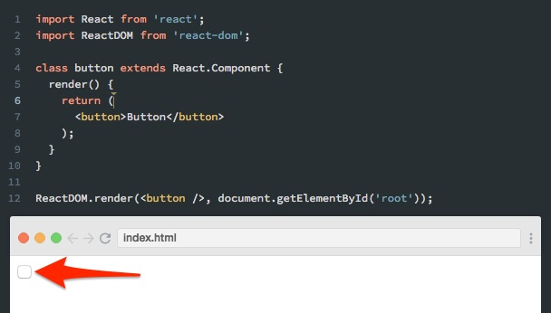

مطور الويب، مهما كان ماهرا أو محترفا، قد يقع في أخطاء بسيطة في بداية مشواره مع تقنية معينة لها خصائص معينة وقواعد يجب احترامها.

[مكتبة React.js](/web-development/javascript/react-javascript-library/) واحدة من تقنيات تطوير الويب التي ذاع صيتها في السنوات الأخيرة وأصبح استخدامها شائعا بشكل كبير من قبل مطوري واجهات الويب الأمامية.

سأحاول في هذا الموضوع جرد أهم وأكثر الأخطاء الشائعة التي يواجهها هؤلاء المطورين مع [React.js](/web-development/javascript/react-javascript-library/)، وهي على بساطتها إلا أنها تحظى بكم هائل من الأسئلة في _StackOverflow_، ما جعلني أحاول جمعها في هذا المقال لتكون مرجعا لكل مطور يفكر في بدء مساره مع هذه المكتبة.

## **1\. تسمية المكونات**

بعض المطورين يقومون بتسمية المكونات بأسماء تبدأ بحروف صغيرة (_lower case_)، وهذا خطأ فادح لأن React سيعتبر هذا المكون عند استدعائه بمثابة وسم HTML اعتيادي وليس _React component_.

```javascript
class mycomponent extends Component {
  /* ... */
}
```

عند محاولة عرض المكون _mycomponent_ أعلاه، سنحصل على رسالة تحذيرية ولن يتم عرضه حتى نقوم بتغيير اسمه ليبدأ بحرف كبير (upper case) كما يلي :

```javascript
class Mycomponent extends Component {
  /* ... */
}
```

وفي حالة استخدام أسماء محجوزة لوسوم HTML مثل button، فإنه عند استدعائه سيقوم React بعرض عنصر ال HTML وإهمال مكون React بشكل كلي.

[](../images/react-button-mistake.jpg)

لذلك في جميع الحالات، **لا بد أن نبدأ أسماء المكونات بحروف كبيرة**.

## **2\. استخدام React.PropTypes**

في السابق كان الكائن _PropTypes_ ضمن الكائن الكبير React، فكان يستخدم بهذه الشكل React.PropTypes.

ولكن في النسخ الأخيرة تم تحويل PropTypes إلى [حزمة مستقلة](https://www.npmjs.com/package/prop-types) يتم تثبيتها عن طريق مدير الحزم npm ثم استيرادها عن الحاجة بهذه الطريقة :

```javascript
import React from 'react';
import PropTypes from 'prop-types';

class MyComponent extends React.Component {
  render() {
  ...
  }
}

MyComponent.propTypes = {
  myFunction: PropTypes.func.isRequired
}
```

## **3\. تمرير الأعداد كما نمرر النصوص**

في React.js يمكن تمرير النصوص للمكونات باستخدام props بهذه الكيفية :

```html
<User name="Ahmed" />
```

ولكن عند تمرير الأعداد فالمسألة تختلف قليلا، حيث أن تمرير العدد بين مزدوجتين سيجعل المكون يعتبر نصا، وبالتالي لن نستطيع تطبيق العمليات الخاصة بالأعداد عليه، مما قد يتسبب في ظهور أخطاء غير متوقعة.

الطريقة الصحيحة لتمرير الخصائص العددية للمكونات في React.js هي وضعها بين الأقواس المعقوفة :

```html
<User age="{30}" />
```

## **4\. الخلط بين الأقواس المعقوفة والأقواس العادية**

عادة ما تستخدم الأقواس العادية (...) لإرجاع محتوى المكونات في الدالة _render_ :

```javascript
render() {
  return (
    <header className="App-header">
      
      <h1 className="App-title">Welcome to React</h1>
    </header>
  );
}
```

وتستخدم كذلك هذه الأقواس بشكل كبير في [الدوال السهمية التي شرحناها في مقال سابق](https://www.tutomena.com/web-development/javascript/arrow-functions-javascript/).

ولكن المبتدئين في أحيان كثيرة يقعون عرضة للخلط بين هذا النوع من الأقواس والأقواس المعقوفة، ما يؤدي لمثل هذه الخطأ :

```js
// خطأ!!
render() {
  return {
    <header className="App-header">
      
      <h1 className="App-title">Welcome to React</h1>
    </header>
  };
}
```

في جافاسكريبت، الأقواس المعقوفة بجانب كلمة _return_ تعني بأنه سيتم إرجاع كائن جافاسكريبت من نوع json، ولكن في هذه الحالة نحن نقوم بإرجاع كود JSX الذي يتم تحويله في مرحلة البناء (_Build step_) لدوال جافاسكريبت عادية، وهذا يخالف توقعات مفسر الجافاسكريبت مما يتسبب أخيرا في ظهور رسالة الخطأ.

## **5\. الخلط بين الكائن state والكائنات الأخرى داخل المكون**

في React.js، يمكن إنشاء كائن محلي اسمه _state_ والوصول إليه انطلاقا من الكائن _this_ الذي يشير لكلاس المكون :

```javascript
class User extends React.Component {
  state = {
    name: "Ahmed",
  };

  render() {
    return \`Name: ${this.state.name}\`;
  }
}
```

المخرج النهائي في هذا الكود سيكون **"Name: Ahmed"**.

إلى جانب الكائن _state_، يمكننا إنشاء كائنات أخرى داخل **كلاس المكون** والوصول إليها بنفس الكيفية من خلال this :

```js
class User extends React.Component {
  user = {
    name: "Ahmed",
  };

  render() {
    return \`Name: ${this.user.name}\`;
  }
}
```

والنتيجة ستكون هي نفسها **"Name: Ahmed"**.

ولكن هناك فرق كبير بين الكائن المسمى state وأي كائن أو خاصية أخرى لمكونات React. هذا الفرق يتمثل في كون **state** يتم استخدامه وإدارته من طرف React لعرض وتحديث حالة المكون (واجهة المستخدم) كلما طرأ تغيير عليه. والطريقة الوحيدة لإحدات تغيير على الكائن state هي عن طريق الدالة _()setState._

أما الكائنات الأخرى مثل _user_ في حالتنا، فهي مجرد خصائص عادية للكلاس ولا تلعب أي دور في تحديث حالة المكون مهما غيرنا من قيمها، ولا تعرض قيمها الجديدة في واجهة المستخدم إلا بعد تحديث المكون عن طريق *()setState.*

## **6\. قيمة _this_ في وظائف الأحداث**

في React.js، جميع الوظائف التي يتم استدعاؤها داخل الدالة _render_ تربط الكائن _this_ بداخلها بكلاس المكون الذي يضمها. ولكن الوظائف التي يتم استدعاؤها عند أحداث معينة (مثلا onClick أو onChange) **استثناء لهذه القاعدة**.

دعونا نرى المثال التالي :

```js
class MyComponent extends React.Component {
  whoIsThis() {
    console.log(this);
  }

  render() {
    this.whoIsThis(); // MyComponent
    return <button onClick={this.whoIsThis}>Who is This</button>; // undefined
  }
}
```

في الشفرة أعلاه، الدالة _()whoIsThis_ التي يتم استدعاؤها من داخل _render_ يؤشر this بداخلها إلى **_MyComponent_**، ولكن عندما نقوم باستدعائها عند النقر على الزر button فإن this يؤشر إلى **_undefined،_** وهذا مشكل كبير لأننا عادة نحتاج لإستخدام this على أنه **المكون نفسه** في هذه الأحداث، وخاصة عند التعامل مع _this.state_ أو _this.props_.

### ما هو الحل إذن ؟

في الحقيقة هناك أكثر من حل لهذا المشكل، ولكن أفضلها بحسب رأيي هو الإستعانة بالدوال السهمية **التي تحفظ للكائن _this_ قيمته مهما اختلفت ظروف استدعائها.**

إذن الحل هنا يكمن في تحويل *()whoIsThis* إلى **دالة سهمية**، لا أقل ولا أكثر، بعدها تعود إلى الأمور إلى نصابها:

```js
class MyComponent extends React.Component {
  whoIsThis = () => {
    console.log(this);
  };

  render() {
    this.whoIsThis(); // MyComponent
    return <button onClick={this.whoIsThis}>Who is This</button>; // MyComponent
  }
}
```

## النهاية

هذه جملة الأخطاء التي يواجهها المبتدؤون بكثرة في بداية مشوارهم مع React.js، وقد واجهت أنا أيضا بعضا منها في أيامي الأولى مع هذه المكتبة :) أتمنى أن تستفيدوا منها وتتجنبوها في مشاريعكم القادمة، وسأحاول تحديث هذه القائمة باستمرار كلما صادفت مشكلا آخر من المشاكل البسيطة التي تواجه المبتدئين مع مكتبة [React.js](https://www.tutomena.com/web-development/javascript/react-javascript-library/).

> لا تنسوا مشاركة هذا الموضوع ـ إذا أعجبكم ـ مع أصدقائكم حتى تعم الفائدة
