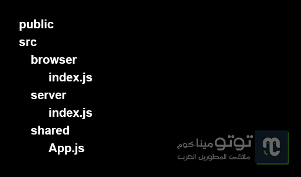
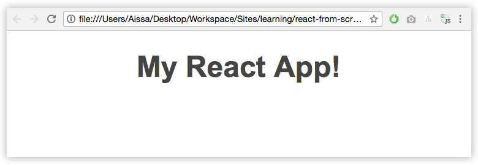
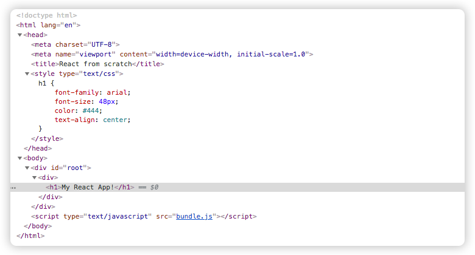
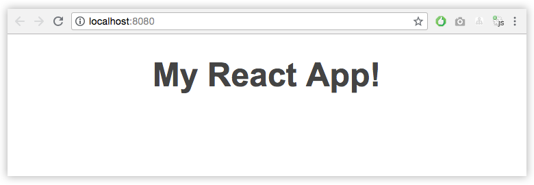

معظمنا ممن سبق لهم التعامل مع **مكتبة React.js** يعلمون بأن أفضل طريقة لبدء أي مشروع هي باستخدام الحزمة [create-react-app](https://github.com/facebook/create-react-app)، وهي الطريقة الرسمية الموصى بها.

لا خلاف على أن هذه الحزمة قيمة جدا وتمكن المطورين من بدء مشاريع React.js بدون مجهود يذكر ومن دون أي إعدادات مسبقة وبالتالي التركيز على [React.js](/web-development/javascript/react-javascript-library/) فقط. ولكن، ماذا لو أردنا **فهم** كل ما يدور في كواليس تلك الحزمة ؟ ماذا لو أردنا إعداد مشروع React.js بأنفسنا ومعرفة كيفية اشتغال هذه المكتبة مع محزم الوحدات الأشهر **Webpack** ؟

حزمة **create-react-app** صممت لجعلك تبدأ العمل مباشرة وتترك لها مهمة إعداد وبناء المشروع، ولا يهمها أن تفهم كيف يقوم Webpack بتحويل أكواد **JSX** إلى **جافاسكريبت** عادي أو طريقة استدعاء واستيراد ملفات **CSS** من داخل **مكونات React** عن طريق **import** إلخ...

إذا أردت أن تفهم كل هذه الأمور وتتعلم كيفية اشتغالها وتناغمها، فعليك إذن أن تقوم بإعداد مشروعك من الصفر.

لهذا الغرض نحن هنا اليوم :)

سنتعلم معا كيفية إعداد مشروع React.js باستخدام [محزم الوحدات Webpack 4](https://www.tutomena.com/web-development/javascript/what-is-webpack/).

## هيا بنا نبدأ العمل

أولا لنفتح نافذة الأوامر السطرية ونقوم بإنشاء مجلد اسمه **react-from-scratch** وبداخله مجلد واحد اسمه **src** يضم بدوره مجلدين اثنين : **components** و **styles**.

```bash
mkdir react-from-scratch
cd react-from-scratch
mkdir -p src/components src/styles
```

[](../images/folders.png)

لتهيئة المشروع، سنقوم بتنفيذ الأمر التالي داخل المجلد `react-from-scratch` وذلك جريا على عادتنا في جميع المشاريع التي تستخدم مدير الحزم [npm](/npm) :

```bash
npm init -y
```

بعد تنفيذ هذا الأمر سيتولد الملف الغني عن التعريف **package.json** :

```json
{
  "name": "react-from-scratch",
  "version": "1.0.0",
  "description": "",
  "main": "index.js",
  "scripts": {
    "test": "echo \"Error: no test specified\" && exit 1"
  },
  "keywords": [],
  "author": "",
  "license": "ISC"
}
```

## تحميل Webpack

**Webpack** ـ كما رأينا في مقال سابق مفصل ـ هو محزم وحدات **Module bundler** يمكننا من تحزيم وجمع ملفات مشروعنا في ملف واحد (في الغالب).

دعونا نقوم بتحميل وتثبيت ويب باك في مشروعنا :

```bash
npm install webpack webpack-cli --save-dev
```

هذا الأمر سيقوم بتحميل كل من حزمتي webpack و webpack-cli. الأولى تضم الوظائف الأساسية لمحزم الوحدات Webpack والثانية تتيح لنا إمكانية استخدام أوامر webpack من نافذة الأوامر السطرية _Command line_.

## تحميل مكتبة React.js

```bash
npm install react react-dom --save
```

## تحميل بابل Babel

حتى تعمل مكتبة React.js بشكل جيد، نحن مطالبون بتثبيت الأداة **Babel** من أجل [تحويل (_Transpile_) أكواد جافاسكريبت ES6](https://www.tutomena.com/web-development/javascript/what-is-transpiling-javascript/) و JSX إلى أكواد جافاسكريبت ES5 مدعومة من كافة المتصفحات.

```bash
npm install babel-core babel-loader babel-preset-env babel-preset-react --save-dev
```

قمنا هنا بتحميل 4 حزم :

1. **babel-core** : الحزمة التي تحتوي على الشفرة المصدرية لنواة بابل.
2. **babel-loader** : هذه الحزمة تمثل ال **loader** الذي يستخدمه webpack لكي يعمل بتوافقية كاملة مع Babel. يعني أن Webpack يستعين **ببابل** في عملية Transpiling قبل أن يقوم بعملية التجميع أو التحزيم ( *Bundling *).
3. **babel-preset-env** : الحزمة التي تمكن نواة بابل من تحويل أكواد جافاسكريبت ES6 إلى أكواد جافاسكريبت ES5.
4. **babel-preset-react** : مسؤولة عن عملية تحويل أكواد JSX إلى جافاسكريبت.

## إنشاء الملف index.js

في انتظار انتهاء عملية التحميل، سنقوم بإنشاء ملف جافاسكريبت جديد **index.js** داخل المجلد **src/**.

هذا الملف سيمثل نقطة الدخول (_Entry point_) بالنسبة لتطبيقنا.

لحد الساعة سنضع فيه هذا الكود البسيط :

```js
class Alert {
  constructor(msg) {
    this.msg = msg;
  }

  show() {
    alert(this.msg);
  }
}
var alert = new Alert('Hello World');
alert.show();
```

## إنشاء الملف index.html

في نفس المكان، أي المجلد `src/`، سننشئ ملف html نقوم بتسميته **index.html** ونضمنه الكود التالي :

```html
<!DOCTYPE html>
<html lang="en">
  <head>
    <meta charset="UTF-8" />
    <meta name="viewport" content="width=device-width, initial-scale=1.0" />
    <title>React from scratch</title>
  </head>

  <body>
    <div id="root"></div>
  </body>
</html>
```

## تعيين ملفي الدخول والإخراج في إعدادات Webpack

سنبدأ الآن في مرحلة إعداد **Webpack**.

لهذا الغرض، سنقوم بإنشاء ملف اسمه **webpack.config.js** في **المجلد الجذر** للمشروع (_react-from-scratch_)، وسنبدأ فيه إعداداتنا بتعيين المسار لكل من ملفي الدخول (Entry file) والإخراج (Output file).

```js
const path = require('path');

module.exports = {
  entry: './src/index.js',
  output: {
    path: path.join(__dirname, '/dist'),
    filename: 'bundle.js',
  },
};
```

ملف الإخراج **bundle.js** ـ الذي يوجد في المجلد **dist/** ـ هو الملف الذي سيجمع فيه Webpack كافة أكواد وملفات جافاسكريبت التي يستخدمها التطبيق. يعني أن الملف الذي سنقوم باستدعائه في الأخير في المتصفح هو **bundle.js**.

المجلد **dist/** سيقوم **Webpack** بإنشائه تلقائيا بجوار **src/**.

## إعداد ال loaders

محزم الوحدات **webpack** لحاله يستطيع **فقط** التعرف على ملفات جافاسكريبت وتحزيمها، وإذا أردنا تحزيم أنواع أخرى من الملفات مثل **Scss** ،**Css** أو حتى **الصور** فإن **ويب باك** سيكون في حاجة لمساعدته لكي يتمكن من التعامل مع مختلف تلك الأنواع من الملفات.

ال **Loader** هو الذي يؤدي هذه الخدمة في بيئة **webpack**، فكل نوع من الملفات يمكن استدعاؤه وتحزيمه كوحدة جافاسكريبت (Javascript Module) بالإستعانة بال Loader الموافق له.

```js
const path = require('path');

module.exports = {
  entry: './src/index.js',
  output: {
    path: path.join(__dirname, '/dist'),
    filename: 'bundle.js',
  },
  module: {
    rules: [
      {
        test: /\.js$/,
        exclude: /node_modules/,
        use: {
          loader: 'babel-loader',
        },
      },
      {
        test: /\.css$/,
        use: ['style-loader', 'css-loader'],
      },
    ],
  },
};
```

**css-loader** هو المكلف باستخلاص أكواد CSS التي تم استدعاؤها باستخدام **require** أو **import** ثم يقوم بتجميعها على شكل string.

**style-loader** يأخذ هذا string ويقوم بوضعه داخل وسم `<style>` في ملف أو صفحة HTML (في مثالنا _index.html_).

لكي يتمكن Webpack من استخدامهما يجب أولا أن نقوم بتحميلهما من مستودع npm كما فعلنا سابقا مع **babel-loader**.

```bash
npm install css-loader style-loader --save-dev
```

## إعداد Babel

حتى نستطيع إعداد بابل لاستخدام ال Presets التي قمنا سابقا بتحميلها (env و react)، يجب علينا إنشاء ملف اسمه **_babelrc._** في المجلد الرئيسي للمشروع، يعني بجوار **package.json** و **webpack.config.js**.

```json
{
  "presets": ["env", "react"]
}
```

## حان الوقت لتشغيل Webpack

لنقم بإضافة هذين السكريبتين إلى المنطقة المخصصة لذلك في ملف **package.json** :

```json
"scripts": {
"dev": "webpack --mode development --watch",
"build": "webpack --mode production"
}
```

السكريبت الأول (**dev**) يقوم بتشغيل **webpack** في **وضع التطوير**، والبارامتر **watch--** يعني بأنه كلما أجرينا تغييرا في الكود فإن Webpack سيقوم تلقائيا بإعادة عملية التجميع والتحزيم، يعني أننا لسنا مضطرين لإعادة تنفيذ الأمر **npm run dev** في كل مرة نقوم بها بإجراء تعديل على أحد الملفات المصدرية للمشروع.

أما السكريبت **build** فهو مسؤول عن تشغيل Webpack وفق **وضع الإنتاج** أو Production وما يعنيه ذلك من ضغط الأكواد والملفات إلخ...

الآن نستطيع تنفيذ الأمر **dev** كما يلي :

```bash
npm run dev
```

سنلاحظ بعد انتهاء عملية التحزيم إنشاء مجلد جديد اسمه **dist/** وبداخله ملف جافاسكريبت باسم `bundle.js`، وفق إعداداتنا على مستوى ملف _webpack.config.js_ :) هذا الملف يضم أكواد **جافاسكريبت ES5** مدعومة ومفهومة من كافة المتصفحات الكبيرة.

إذن webpack يشتغل كما يجب ومن دون أخطاء :D

- [قد يهمك أيضا : شرح أساسيات React.js – مكتبة جافاسكربت لتطوير واجهات المستخدم](https://www.tutomena.com/web-development/javascript/react-javascript-library/)

## لنقم بإنشاء مكون React.js الرئيسي لمشروعنا

في داخل المجلد **components** سنقوم بإنشاء ملف اسمه _App.js_ ونضع فيه الشفرة البرمجية الآتية :

```jsx
import React, { Component } from 'react';

import '../styles/App.css';

class App extends Component {
  render() {
    return (
      <div>
        <h1>My React App!</h1>
      </div>
    );
  }
}

export default App;
```

نلاحظ بأننا قمنا باستدعاء ملف `App.css`، لنقم بإنشاء هذا الملف في داخل المجلد **styles**، ولنضع فيه ما يلي :

```css
h1 {
  font-family: arial;
  font-size: 48px;
  color: #444;
  text-align: center;
}
```

قمنا باستدعاء هذا الملف حتى نتأكد من أن كلا من css-loader و style-loader يعملان بشكل جيد.

لنعد الآن إلى الملف `src/index.js` الذي أنشأناه سابقا ووضعنا فيه كودا تجريبيا.

لنمسح ذلك الكود التجريبي ولنعوضه بما يلي :

```jsx
import React from 'react';
import ReactDOM from 'react-dom';
import App from './components/App.js';

ReactDOM.render(<App />, document.getElementById('root'));
```

## تحميل الإضافة html-webpack-plugin

لحد الساعة كل ما يقوم به webpack هو توليد المجلد dist/ وبداخله الملف bundle.js فقط!

أين هي صفحة html التي سنقوم بعرضها على المتصفح ؟

اطمئنوا، فإضافة html-webpack-plugin هنا لمساعدتنا في توليد ملف html داخل المجلد dist/ وتحقن فيه **بشكل آلي** ملف جافاسكريبت **_bundle.js_** المُخرَج.

```bash
npm install html-webpack-plugin --save-dev
```

بعد تحميل حزمة **html-webpack-plugin**، سيكون علينا إتمام عملية إعدادها من ملف webpack.config.js :

```js
const path = require('path');
const HtmlWebpackPlugin = require('html-webpack-plugin');

module.exports = {
  entry: './src/index.js',
  output: {
    path: path.join(__dirname, '/dist'),
    filename: 'bundle.js',
  },
  module: {
    rules: [
      {
        test: /\.js$/,
        exclude: /node_modules/,
        use: {
          loader: 'babel-loader',
        },
      },
      {
        test: /\.css$/,
        use: ['style-loader', 'css-loader'],
      },
    ],
  },
  plugins: [
    new HtmlWebpackPlugin({
      template: './src/index.html',
    }),
  ],
};
```

سيقوم ويب باك بإنشاء ملف اسمه **index.html** وفق القالب src/index.html وسيقوم بحقن السكريبت bundle.js أسفله بشكل آلي.

بعد تنفيذ الأمر npm run dev  سنلاحظ بأنه تم فعلا توليد الملف index.html داخل المجلد dist وإلى جانبه طبعا ملف bundle.js.

عندما نفتح الملف **dist/index.html** في المتصفح سنرى النتيجة المتوقعة :)

[](../images/webpack-react-1.png)

وإذا ألقينا نظرة على الشفرة المصدرية للصفحة فإننا سنرى ما يلي :

[](../images/webpack-react-output-html.png)

1. تم حقن المكون `<App>` داخل العنصر **div#root**.
2. تمت إضافة محتوى الملف `App.css` إلى الوسم `<style>`.
3. تم استدعاء ملف الجافاسكريبت _bundle.js_ أسفل الصفحة، تحديدا قبل إغلاق الوسم `<body>`.

## نقطة سلبية

إلى الآن تطبيقنا يشتغل بشكل جيد، ولكننا مطالبون كما لاحظتم بفتح الملف index.html بشكل يدوي في المتصفح، وبعد كل عملية تعديل على الملفات المصدرية يجب تحديث الصفحة لكي نرى النتيجة :-? كما أنه كما رأيتم، فتحنا الصفحة باستخدام البروتوكول  `file://` لأننا لا نتوفر على أي خادم ويب محلي (_localhost_). هذه الطريقة غير عملية وستثبت محدوديتها في العديد من الحالات (مثلا عند القيام بطلبات Ajax إلخ...).

## الحل في Webpack-dev-server

هناك حزمة npm تقوم بتوفير كل تلك المزايا الناقصة عوض محاولة إضافتها بأنفسنا من الصفر، إنها حزمة [webpack-dev-server](https://github.com/webpack/webpack-dev-server).

```bash
npm install webpack-dev-server --save-dev
```

سنقوم بإجراء تعديل على السكريبت **dev** في ملف package.json، على اعتبار أن webpack-dev-server يهدف أولا وأساسا لجعل حياة المطور في **وضع التطوير** أكثر سهولة وعملية.

```json
"scripts": {
"dev": "webpack-dev-server --mode development --open --hot",
...
}
```

قمنا بإضافة معاملين اثنين :

- `--open` : من أجل فتح المشروع **بشكل آلي** في المتصفح.
- `--hot` : تحديث الصفحة **أوتوماتيكيا** بعد كل عملية تعديل على الكود.

إذن بعد تنفيذ الأمر `npm run dev` ، سيفتح المتصفح مشروعنا وتظهر لنا هذه الصفحة الجميلة :-)

[](../images/webpack-react-2.png)

## النهاية

هكذا نكون قد أعددنا مشروع **React.js** الخاص بنا من الصفر، وتعلمنا سويا الكثير من الأشياء التي تخص بالأساس webpack ،babel وكذلك طريقة دمج خادم ويب في المشروع عن طريق الحزمة **webpack-dev-server**.

كل هذه الأدوات وغيرها تستخدم في كواليس الحزمة **create-react-app** لجعل مهمة المطورين في بدء مشاريع React.js سهلة ومنحهم الفرصة للتركيز أكثر على الكود عوض الإعدادات الجانبية.

ولقد بينت في مقدمة هذا الدرس بأن أفضل وسيلة لبدء مشروع React.js هي عن طريق create-react-app، وهدفنا الأول والأخير من هذا الدرس هو معرفة كيفية عمل هذه الحزمة في ما وراء الستار واكتشاف مزايا **webpack** الكثيرة.

---

سأسعد كثيرا بقراءة تعليقاتكم على الموضوع، كما سيسرني كثيرا أن تشاركوا هذا المحتوى ـ إن أعجبكم ـ مع أصدقائكم المطورين.

---

#### مراجع

- [Hackernoon.com](https://hackernoon.com/how-to-build-a-react-project-from-scratch-using-webpack-4-and-babel-56d4a26afd32)
- [Webpack.js.org](https://webpack.js.org/configuration/dev-server/)
- [medium.com](https://medium.com/a-beginners-guide-for-webpack-2/webpack-loaders-css-and-sass-2cc0079b5b3a)
