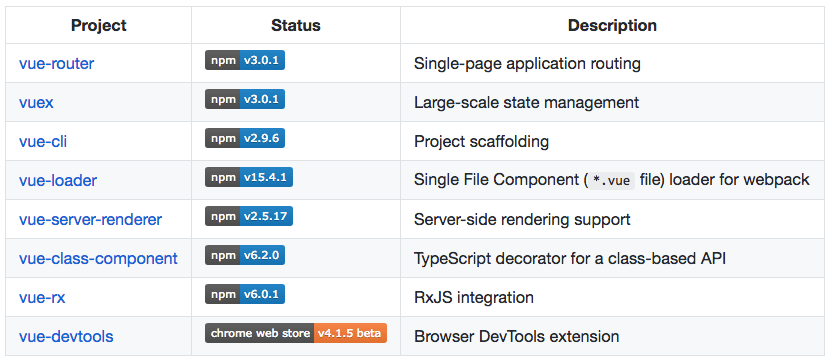

لا شك في أن مكتبتي ـ أو لنقل إطاري العمل ـ **Vue.js** و **React.js** قد حققا كلاهما نجاحا هائلا في الخمس سنوات الماضية، وأصبحا يستحوذان على نسبة كبيرة جدا من سوق أطر عمل جافاسكريبت.

ما نعرفه جميعا أن لكل إطار عمل جمهوره الخاص المعجب بفلسفته وطريقة حله للأمور، ولكل مجتمع من مجتمعات أطر عمل جافاسكريبت دوافعه وأسبابه التي يدافع بها عن اختياره.

في هذا المقال لن أقوم بجرد وتعداد مزايا كل إطار عمل على حدة، لأننا كتبنا مواضيع متعددة في هذا الصدد. وإذا كنت من متابعي مدونة توتومينا فمن المؤكد بأنك قرأت العديد من المقالات التي شاركناها معكم وتمس جوانت عديدة من React و [Vue.js](/vuejs-framework).

اليوم سنشارك معكم بالتحديد أهم الأسباب التي تجعل معظم مطوري [Vue.js](/vuejs-framework) يفضلون الأخير على [React.js](https://www.tutomena.com/web-development/javascript/react-javascript-library/).

## سهولة التعلم والبدء

ربما يتفق الجميع على أن إطار العمل Vue.js يتميز بكونه يوفر واجهة برمجية بسيطة وحدسية (Intuitive API)، بالإضافة إلى التوثيق الممتاز والدليل الأكثر من رائع على الموقع الرسمي. هذان العاملان، التوثيق الجيد والتركيب (Syntax) الحدسي، يولدان لدى القادمين الجدد شعورا بالراحة والقدرة على استيعاب أفكار Vue.js بسرعة.

هذا الدافع ـ *سهولة التعلم والبدء* ـ زادت قوته بعد إصدار **Vue CLI** الجديد والذي حمل الرقم 3، إذ بات بإمكان المطورين إنشاء مشاريعهم وإدارة التبعيات (_Dependencies_) انطلاقا من واجهة مستخدم رسومية (UI) ، وليس فقط من نافذة الأوامر السطرية كما كان الأمر من قبل.

<iframe width="560" height="315" src="https://www.youtube.com/embed/cP9bhEknW_g?controls=0" frameborder="0" allow="accelerometer; autoplay; encrypted-media; gyroscope; picture-in-picture" allowfullscreen="allowfullscreen"></iframe>

هذه الفكرة لم يسبق Vue.js إليها أحد من أطر عمل جافاسكريبت الأخرى على حد علمي، وأظن بأنها خطوة جيدة نحو مزيد من التحسين لتجربة المطورين مع هذا **الفريموورك**.

## الفصل بين الجافاسكريبت، Html و Css

دائما ما يتم وصف Vue.js بأنه مزيج من Angular وReact، وربما هذا الوصف يتجلى بشكل واضح في كيفية فصل الثلاثي Html ،JavaScript و Css.

في Angular نجد هناك فصلا تاما بين هؤلاء الثلاثة، كل مكون لديه قالب Html خاص به، وملف آخر خاص بأكواد جافاسكريبت (Typescript) وأكواد Css بدورها يتم وضعها في ملف خاص ومستقل.

في React.js، حيث كل شيء تقريبا عبارة عن جافاسكريبت، يتم تضمين كل ذلك في ملف واحد هو ملف الجافاسكريبت الخاص بالمكون (Component). أكواد **Jsx** في ملف جافاسكريبت يتم تحويلها في مرحلة البناء (Build) [عن طريق Webpack و Babel](https://www.tutomena.com/web-development/javascript/react-app-from-scratch-using-webpack4/) إلى أكواد جافاسكريبت عادية ثم إلى Html كمرحلة أخيرة. أما تنسيقات CSS فيتم إضافتها كذلك من داخل ملف Javascript باتباع عدة طرق مختلف سبق وخصصنا موضوعا كاملا لشرحها وتفصيلها:

- [تعرف على 4 طرق لتنسيق المكونات في React.js](https://www.tutomena.com/web-development/javascript/styling-react-components/)

إطار العمل Vue.js جمع بين هذا وذاك، بإمكاننا جمع Html ،Javascript و Css في ملف واحد، ولكن ليس ملف جافاسكريبت، بل ملفا امتداده **vue.** (مثلا: `Hello.vue`) وفيه يتم تضمين كل ما سبق. كود HTML داخل وسم `<template>`، كود جافاسكريبت داخل وسم `<script>` وCss يضاف في الوسم `<style>`.

فصل تام بين الثلاثي (فكرة Angular) ولكن داخل الملف نفسه (فكرة React.js)، لسنا مضطرين للتنقل بين عدة ملفات عند العمل على مكون معين، كل شيء يتم داخل الملف `vue.` :) فكرة عبقرية أليس كذلك ؟

## Vue.js محاط بمكتبات مدعومة كلها رسميا

عندما نتكلم عن React.js أو Vue.js فإننا نصفهما باسم **إطار العمل**، رغم أنهما في حقيقة الأمر مجرد مكتبتان تؤديان دورا محددا بدقة، ألا وهو بناء واجهات الويب الأمامية.

في Vue.js وReact.js لا وجود لنظام Routing، مثلما هو الحال في Angular مثلا. كما أنه ليس هناك نظام قائم بذاته لإدارة الحالة (_State management_) إلخ...

إذن لماذا نقول عنهم بأنهما أطر عمل جافاسكريبت رغم ذلك ؟

في بيئة Vue.js وكذلك React.js هناك مكتبات مستقلة تقوم بكل تلك الأدوار، عندما تشتغل جنبا إلى جنب مع المكتبة الأم يتشكل لدينا نظام كامل يصلح أن نصفه بإطار العمل أو Framework.

في Vue.js على سبيل المثال هناك مكتبة **Vue-router** لإضافة نظام Routing، وكذلك مكتبة **Vuex** لإدارة الحالة في تطبيقات Vue.js وفق نمط Flux. طبعا يمكن إدارة الحالة بدون Vuex، ولكن هذا الخيار يصبح صعبا ومعقدا كلما كان حجم التطبيق كبيرا.

بالإضافة إلى Vuex و Vue-router، هناك مكتبات وحزم أخرى طورت حول Vue.js لجعله إطار عمل متكامل وقوي.

في عالم React، هناك مكتبات تقوم بكل هذه الأشياء ولكنها غير تابعة لشركة فيسبوك أو للفريق المطور للمكتبة. لذلك تصادف العديد من الأسئلة في بيئة React من قبيل :

- هل أستخدم _Redux_ أم _MobX_ ؟
- هل أستخدم _styled-components_ أم Css بشكل عادي ؟
- إلخ...

## في الختام

هذه تقريبا أبرز الأسباب التي تجعل بعض الناس يفضلون Vue على React.

في الماضي كان AngularJs هو المسيطر ولكن مع قدوم React.js وVue.js تغيرت المعادلة واحتدمت المنافسة أكثر بين أطر عمل جافاسكريبت. كل إطار عمل يحاول بناء فلسفته وطريقته الخاصة في مقاربة الأمور، ولكل مطور قناعاته الخاصة وأسبابه التي يراها وجيهة لإختيار إطار عمل على حساب آخر.

- **قد يهمك أيضا :** [كل ما تريد معرفته عن أطر العمل Angular ،React.js و Vue.js](https://www.tutomena.com/web-development/javascript/react-vue-angular-comparison/)
- **قد يهمك أيضا :** [إطار العمل Vue.js.. ثلاثة أسباب قد تدفعك لإختياره](https://www.tutomena.com/web-development/javascript/3-reasons-to-choose-vuejs-framework/)
- **قد يهمك أيضا :** [من jQuery إلى React.js.. كيف ظهرت وتطورت أطر عمل جافاسكريبت ؟](https://www.tutomena.com/web-development/javascript/history-javascript-frontend-frameworks/)
