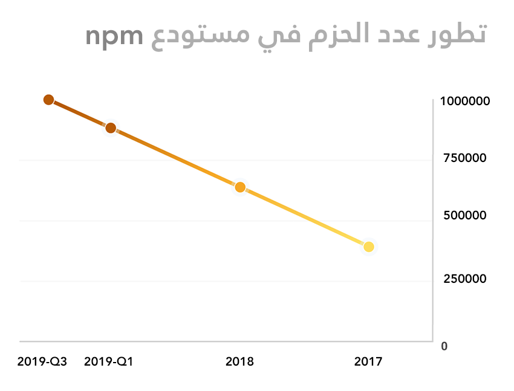

لا يوجد مطور جافا سكريبت أو Node.js لم يسبق له التعامل مع مدير الحزم **npm** أو Node package manager.

في هذه المدونة استعملناه مرارا وتكرارا في دروس ومقالات متعددة لتثبيت حزم Node.js والقيام بمختلف العمليات التي تخصه انطلاقا من نافذة الأوامر السطرية.

في متم 2019 بلغ عدد الحزم الموجودة في [مستودع NPM](https://www.npmjs.com/) أكثر من **1 مليون حزمة** تلبي تقريبا كافة الإحتياجات التي قد تفكر فيها، ليكون بذلك أكبر وأضخم مستودع للحزم من بين جميع مستودعات لغات البرمجة الأخرى.



## تحميل وتثبيت npm

بمجرد تثبيت بيئة التشغيل [Node.js](/web-development/javascript/what-is-nodejs/) في جهازك فإنه سيتم تلقائيا تثبيت **مدير الحزم npm** أيضا.

للتأكد من أن npm مثبت فعلا في الجهاز، قم بتنفيذ الأمر التالي في نافذة الأوامر السطرية (Terminal):

```bash
npm -v
```

سيتم إظهار نسخة npm في جهازك أو رسالة خطأ في حال لم تتم عملية التسطيب كما يجب.

```terminal
6.9.0
```

## استعمالات مدير الحزم npm

### 1. تهيئة مشروع Node.js جديد

يمكن الدخول لأي مجلد جديد وتنفيذ `npm init` ليتم إنشاء ملف `package.json` جديد.

هذا الملف يضم كافة التبعيات الخاصة بالمشروع، ولذلك نجده في كافة مشاريع Node.js و JavaScript الحديثة.

### 2. تحميل التبعيات

لتحميل تبعيات المشروع يكفي تنفيذ الأمر التالي:

```bash
npm install
```

بمجرد تنفيذ هذا الأمر سيتم البحث عن الملف `package.json` وتحميل كافة التبعيات التي يضمها.

تبعيات المشروع نجدها في مجلد اسمه `node_modules` ولعلك شاهدت هذا المجلد من قبل في مواضع عدة.

### 3. تحميل حزمة محددة

يمكن تحميل حزمة محددة (مثلا مكتبة React) بهذه الطريقة:

```bash
# npm install <package-name>
npm install react
```

ويمكن إضافة البارامتر `--save-dev` إلى هذا الأمر لكي نخبر npm بأن التبعية خاصة ببيئة التطوير فقط (Developement) ولا يجب تضمينها في ملف (أو ملفات) جافا سكريبت التي يتم بناؤها لبيئة الإنتاج (Production).

هذا مثال لتحميل مكتبة `jest` التي نستعملها في **الإختبارات الوحداتية** (Unit Testing) لمشاريع جافا سكريبت:

```bash
npm install jest --save-dev
```

التبعيات الخاصة **بمرحلة التطوير** يتم إضافتها لمنطقة خاصة في ملف `package.json` اسمها `devDependencies`.

<div class="filename">package.json</div>

```json{10-12}
{
  "name": "react-project",
  "version": "0.1.0",
  "private": true,
  "dependencies": {
    "react": "^16.12.0",
    "react-dom": "^16.12.0",
    "react-scripts": "3.3.1"
  },
  "devDependencies": {
    "jest": "24.9.0"
  },
  "browserslist": {
    "production": [">0.2%", "not dead", "not op_mini all"],
    "development": [
      "last 1 chrome version",
      "last 1 firefox version",
      "last 1 safari version"
    ]
  }
}
```

### 4. تحديث التبعيات

تحديث التبعيات كذلك في غاية السهولة مع npm:

```bash
npm update
```

هذا الأمر سيمر على جميع تبعيات المشروع في الملف `package.json` ويقول بتحديثها في حال وجود أي تحديث لكل واحدة منها.

ويمكن تحديث تبعية بعينها بإضافة اسمها كما يلي:

```bash
npm update <package-name>
```

### 5. التحكم في الإصدارات

في كثير من الأحيان نجد أن الإصدار الرئيسي لحزمة معينة فيه خطأ (Bug) وبالتالي ليس مستقر تماما، أو ببساطة نجد أنه غير متوافق مع مكتبة أخرى نستخدمها في نفس المشروع. عوض انتظار تصحيح هذا الخطأ من طرف القائمين على الحزمة، يمكننا تحميل إصدار أقدم ويعمل بشكل جيد ومتوافق مع كل تبعيات مشروعنا.

هذا متاح بسهولة مع Node Package Manager، فقط نقوم بإضافة الرمز `@` إلى اسم الحزمة وبعدها الإصدار الذي نريد تحميله:

```bash
npm install package@version
```

هكذا نكون متأكدين بأن جميع المتدخلين أو العاملين في المشروع يستعملون نفس الإصدارات للحزم، والفضل في هذا يعود للملف `package.json` الذي يُسَجَّل فيه إصدار أي مكتبة أو حزمة نقوم بتحميلها.

### 6. تشغيل المهام

تشغيل المهام أو Running Tasks من الأمور المهمة كذلك التي يضطلع بها مدير الحزم NPM.

في ملف `package.json` يمكننا تعيين المهام التي نريد تنفيذها في Terminal وذلك بكتابة `npm run` متبوعا باسم المهمة التي نريد تشغيلها:

```bash
npm run <task>
```

يتم تعيين تلك المهام في المنطقة `scripts` من الملف `package.json`.

<div class="filename">package.json</div>

```json
{
  "scripts": {
    "watch": "webpack --watch --progress --colors --config webpack.conf.js",
    "dev": "webpack --progress --colors --config webpack.conf.js",
    "prod": "NODE_ENV=production webpack -p --config webpack.conf.js"
  }
}
```

في المثال أعلاه بعض المهام التي نستخدمها في العادة عند التعامل مع [المحزم Webpack](/web-development/javascript/what-is-webpack/).

عوض كتابة ما يلي في نافذة الأوامر السطرية:

```
webpack --watch --progress --colors --config webpack.conf.js
```

نكتب بدلا عنه فقط:

```
npm run watch
```

الأمران مترادفان ولكن الثاني **أسهل بكثير سواء من ناحية كتابته أو حتى حفظه وتذكره**.

## في الختام

استعمال **مدير الحزم npm** شائع جدا في يومنا هذا في مجال تطوير تطبيقات الويب، وفي كل مرة نريد تحميل حزمة Node.js فلابد من استعماله.

هو بالنسبة لمطوري الويب و Node.js بمثابة `pip` أو [composer](/web-development/tools/composer-dependencies-manager/) لمطوري Python و PHP.

مثله مثل مدير النسخ git، أصبح التعامل مع npm ونافذة الأوامر السطرية (Command Line) من الأمور الأساسية التي يتعامل معها المطورون بشكل يومي في أيامنا الحالية، ولذلك لا بد من استيعاب الموضوع بشكل جيد حتى نحقق منه الإستفادة القصوى.

<Author slug="aissa" />
